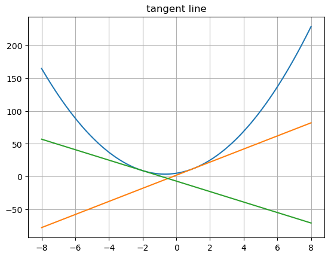

# 导数，求微分，常微分

在函数 $y = f(x)$ 中，假设 $x$ 的微小变化量为 $\Delta x$, 则：
$$ f^{'}(x) = \lim_{{\Delta x} \to {\infty}}{\frac {f(x+\Delta x) - f(x)} {\Delta x}}$$
函数 $f^{'}(x)$被称作 $f(x)$ 的导数(或导函数)。
从函数 $f(x)$ 得到导数 $f^{'}(x)$ 的行为，称为对函数 $f(x)$ 求**微分**.
这里函数的变量只有一个$x$, 这种针对单一变量函数的微分被称为**常微分**。 

切线的意思是与曲线相交，同时相交的点有且只有一个点。 切线在曲线上的点 $(a, f(a))$ 的表达公式：
$$ y = f^{'}(a)x + f(a) - f^{'}(a)a $$


### 使用导数绘制函数 $y = 3x^2 + 4x + 5$ 在 $x=1, x=-2$时的切线 - tangent line：

```python
import numpy as np
import matplotlib.pyplot as plt
x  = np.linspace(-8, 8, 100)
y = 3*x**2 + 4*x + 5
yy = 10*x + 2##(x = 1 处的切线）
y_minus_2 = -8*x - 7#(-2 处的切线）
plt.plot(x, y)
plt.plot(x, yy)
plt.plot(x, y_minus_2)
plt.grid()
```
