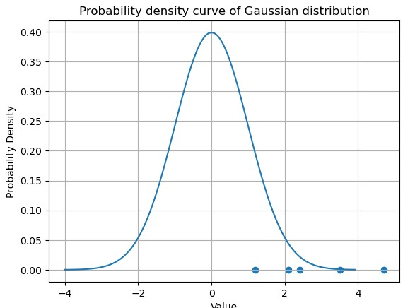
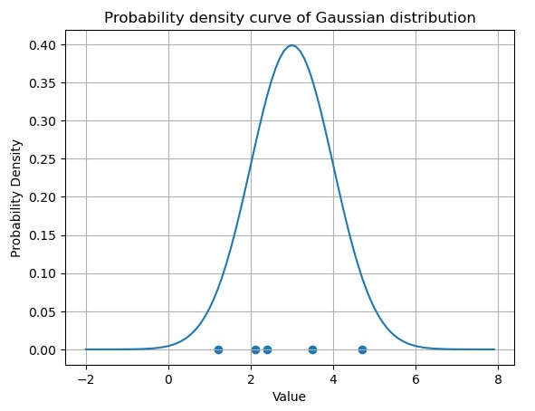

# 随机变量
随机变量一般用大写的 $X$表示，样本值用小写的 $x$ 表示。 


# 统计推断
统计推断是指根据样本数据对总体的分布或数字特征等做出合理的推断。

## 参数估计

参数估计是统计推断的一种基本形式，是数理统计学的一个重要分支，它是根据样本数据来估计总体分布中未知参数的取值。

## 最大似然估计法 - maximum likelihood estimation
最大似然思想的直观想法是：一个随机试验如有若干个可能的结果A, B, C, ... 若在一次试验中，结果A出现了，则一般可以认为试验条件应该是对A出现有利，也即试验条件应为使A出现的概率最大。 

$$L(\theta) = L(x_1, x_2, \cdots, x_n; \theta) = P\{X_1 = x_1, X_2 = x_2, \cdots, X_n = x_n \} = \prod_{i=1}^n p(x_i;\theta) $$
似然方程：
$$\frac {dL(\theta)} {d\theta} = \frac {dL(x_1, x_2, \cdots, x_n;\theta)} {d\theta} = 0$$ 
对数似然方程：
$$\frac {dL(\theta)} {d\theta} = \frac {dlnL(x_1, x_2, \cdots, x_n;\theta)} {d\theta} = 0$$
求出驻点，然后判断得到最大值点$\hat \theta(x_1, x_2, \cdots, x_n)$, 即为参数 $\theta$ 的最大似然估计值.

如果样本点处在较偏的位置，发生的概率较低，则数据的合理性不足，似然和对数似然值都较小：
```python
import numpy as np
import matplotlib.pyplot as plt
x = np.linspace(-4, 4, num=100, endpoint=False)
x_data = np.array([2.4, 1.2, 3.5, 2.1, 4.7])
y_data = np.zeros(5)
def gaussian(mu, sigma, x):
    return 1/(np.sqrt(2*np.pi) * sigma) * np.exp(-(x - mu)**2/(2*sigma**2))
y = gaussian(0, 1, x)
plt.scatter(x_data, y_data)

proba = gaussian(0, 1, x_data)
likelihood =np.prod(proba)
log_likelihood =np.sum(np.log(proba))
plt.plot(x, y)
plt.title('Probability density curve of Gaussian distribution')
plt.xlabel('Value')
plt.ylabel('Probability Density')
likelihood, log_likelihood
```
结果：
```python
1.0632480805734735e-12, -27.569692666023364 # 似然值极小
```


如果样本点处在概率较高的位置，则似然和对数似然值比在较偏位置时大很多。所以似然值表示了样本点的合理性：
```python
x = np.linspace(-2, 8, num=100, endpoint=False)
y = gaussian(3, 1, x)
plt.scatter(x_data, y_data)

proba = gaussian(3, 1, x_data)
likelihood =np.prod(proba)
log_likelihood =np.sum(np.log(proba))
plt.plot(x, y)
plt.title('Probability density curve of Gaussian distribution')
plt.xlabel('Value')
plt.ylabel('Probability Density')
likelihood, log_likelihood 
```
结果：
```python
(0.00023178677874504004, -8.369692666023363) # 似然值变大
```


# 数学期望/均值 - Mathematical Expectation
设离散型随机变量X的分布律为 $P\{X = x_i\} = p_i, i=1, 2, ...$, 如果级数 $\sum_{i=1}^{\infty}x_i p_i$ 绝对收敛, 则称$\sum_{i=1}^{\infty}x_i p_i$为随机变量 $X$ 的数学期望或均值，也可以称为该分布的数学期望或均值，记为 $E(X)$ 或者 $EX$，即：
$$ E(X) = \sum_{i=1}^{\infty}x_i p_i$$

数学期望与一般的平均值不同，它是从概率的角度来描述随机变量 $X$ 取所有可能值的平均值，具有重要的统计意义。

### 分赌本问题：
甲乙各出30元进行赌博，约定谁先赢3局，谁就赢得全部的赌注，两人赌技相当，且每局无平局出现。如果甲赢先赢了2局，已赢了1局时，因故不得不终止赌局，问如何分这60元才合理？


# 方差

对于随机变量X， 若 $E{[X - E(X)]^2}$ 存在，则称其为 $X$ 的方差，或者相应分布的方差，记为 $D(X)$ 或者 $Var(X)$， 即：
$$D(X) = Var(X) = E\{[X-E(X)]^2\}$$
称 $\sqrt {D(X)}$ 为 $X$的标准差，或者相应分布的标准差。 
方差和标准差都可以描述随机变量的取值相对于其数学期望的集中或分散程度，方差标准差越小，随机变量取值越集中，反之，方差标准差越大，随机变量的取值越分散。 区别主要在量纲上。 

```python
import numpy as np
x_1 = np.array([55, 45, 60, 40])
x_2 = np.array([51, 49, 52, 48])

#求方差
print(np.var(x_1))
print(np.var(x_2))
print(np.std(x_1))
print(np.std(x_2))
```
结果：

```python
62.5
2.5
7.905694150420948
1.5811388300841898

```